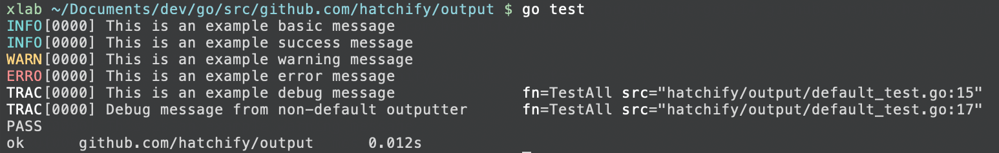
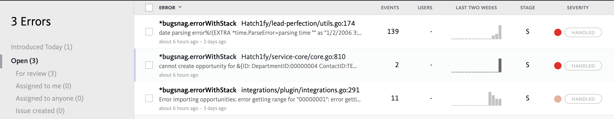
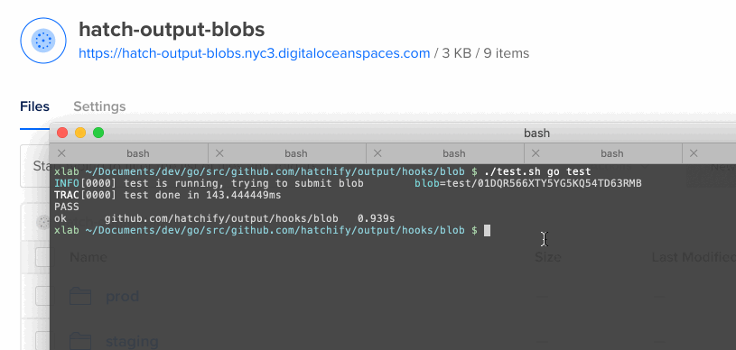

# Output [](https://godoc.org/github.com/hatchify/output) 
Output is an output logging library that is now based on [github.com/sirupsen/logrus](https://github.com/sirupsen/logrus), which enables structured, leveled logging with hooks support.



## Init options

```go
NewOutputter(wc io.Writer, formatter Formatter, hooks ...Hook) Outputter
```

Available formatters:
* `output.JSONFormatter` — outputs all log entries as JSON objects
* `output.TextFormatter` — outputs log entries as text lines for TTY or without TTY colors.

Available hooks:
* [github.com/hatchify/output/hooks/debug](https://github.com/hatchify/output/blob/master/hooks/debug/hook.go#L14)
* [github.com/hatchify/output/hooks/blob](https://github.com/hatchify/output/blob/master/hooks/blob/hook.go#L14)
* [github.com/hatchify/output-bugsnag/hooks/bugsnag](https://github.com/hatchify/output-bugsnag/blob/master/hooks/bugsnag/hook.go#L13)

## Leveled Logging

Output supports 7 levels: `Trace`, `Debug`, `Info`, `Warning`, `Error`, `Fatal` and `Panic`.

```go
out.Trace("Something very low level.")
out.Debug("Useful debugging information.")
out.Info("Something noteworthy happened!")
out.Warn("You should probably take a look at this.")
out.Error("Something failed but I'm not quitting.")
// Calls os.Exit(1) after logging
out.Fatal("Bye.")
// Calls panic() after logging
out.Panic("I'm bailing.")
```

You can set the logging level on an Outputter, then it will only log entries with that severity or anything above it:

```go
// Will log anything that is info or above (warn, error, fatal, panic). Default.
out.SetLevel(output.InfoLevel)
```

Different levels will produce output of different colors. Also, some hooks will trigger on specific levels. For example, a debug hook will add infomation about line for `Debug` log entries. Another hook that enables Bugsnag support will report all errors and warnings to an external service.

## Structured Logging

In addition to log leveling, the new output package enables providing additional fields without altering the original message. By using this feature a developer can provide additional debug context.

```go
out.WithFields(output.Fields{
    "module": "accounts",
    "accountID": "7411f7a4-e4ff-4a03-96dd-f9b8a72d9c3b"
}).Error("account check failed")
```

In this case accountID will be logged as a separate column and can be parsed and used as a filter. When using with external services like Bugsnag, these fields are reported in metadata tab and can be used for filtering too.

In order to be compatible whith previous version of output package, the default wrapper that initializes output will put the prefix name as "prefix" field.

Output fields can be joined and chained:

```go
func init() {
    out = out.WithField("module", "fooer")
}

func runningFoo() {
    fooOut := out.WithField("action", "foo")

    for _, itemName := range items {
        itemOut := fooOut.WithField("item", itemName)
        itemOut.Info("processing item!")
    }
}
```

Use chaining to avoid duplication of field context in sub-routines!

An example of issuing a warning without changing the original error:
```go
out.WithError(err).Warnln("something wrong happened")
```

## Hooks

During output initialisation it is possible to specify output hooks. Hooks are plugins that will pre-process log entries and do something useful. Below are several examples that are available to output users.

### Debug

Debug hook adds information about caller fn name and position is source code. By default applies only to `Debug` and `Trace` entries, but can be extended to any level.

```go
import debugHook github.com/hatchify/output/hooks/debug
```

Options:

```go
type HookOptions struct {
    // AppVersion specifies version of the app currently running.
    AppVersion string
    // Levels enables this hook for all listed levels.
    Levels []logrus.Level
    // PathSegmentsLimit allows to trim amount of source code file path segments.
    // Untrimmed: /Users/xlab/Documents/dev/go/src/github.com/hatchify/output/default_test.go
    // Trimmed (3): hatchify/output/default_test.go
    PathSegmentsLimit int
}
```

If not specified, AppVersion is set from **OUTPUT_APP_VERSION** env variable. PathSegmentsLimit is set to 3 by default, which means the latest 3 path segments of the source path.

### Bugsnag

Bugsnag hook implements integration with [Bugsnag.com](https://app.bugsnag.com) service for error tracing and monitoring. It will send any entry above warning level, including its meta data and stack trace.



```go
import bugsnagHook github.com/hatchify/output-bugsnag/hooks/bugsnag
```

Options:

```go
type HookOptions struct {
    // Levels enables this hook for all listed levels.
    Levels       []logrus.Level

    Env               string
    AppVersion        string
    BugsnagAPIKey     string
    BugsnagEnabledEnv []string
    BugsnagPackages   []string
}
```

Be default reporting is enabled for all levels above `Warning`.

The hook can be enabled in default outputter by setting OS ENV variables:

* OUTPUT_ENV (e.g. `test`, `staging` or `prod`)
* OUTPUT_APP_VERSION
* OUTPUT_BUGSNAG_KEY
* **OUTPUT_BUGSNAG_ENABLED** — this option enables bugsnag in default outputter for existing codebase.

### Blob Uploads

Blob hook allows to upload heavy blobs of data such as request and response HTML / JSON dumps into a remote log storage. This hook utilizes Amazon S3 interface, therefore is compatible with any S3-like API such as DigitalOcean Spaces.



```go
import blobHook github.com/hatchify/output/hooks/blob
```

Options:

```go
type HookOptions struct {
    Env               string
    BlobStoreURL      string
    BlobStoreAccount  string
    BlobStoreKey      string
    BlobStoreEndpoint string
    BlobStoreRegion   string
    BlobStoreBucket   string
    BlobRetentionTTL  time.Duration
    BlobEnabledEnv    map[string]bool
}
```

Be default blob uploading is enabled for all levels.

The following OS ENV variables are mapped:

* OUTPUT_ENV
* OUTPUT_BLOB_STORE_URL
* OUTPUT_BLOB_STORE_ACCOUNT
* OUTPUT_BLOB_STORE_KEY
* OUTPUT_BLOB_STORE_ENDPOINT
* OUTPUT_BLOB_STORE_REGION
* OUTPUT_BLOB_STORE_BUCKET
* **OUTPUT_BLOB_ENABLED** — this option enables blob in default outputter for existing codebase.

How to use:

```go
out.WithField("blob", testBlob).Infoln("test is running, trying to submit blob")
```

Where field name should be exactly `blob` and `testBlob` should be `[]byte`.
